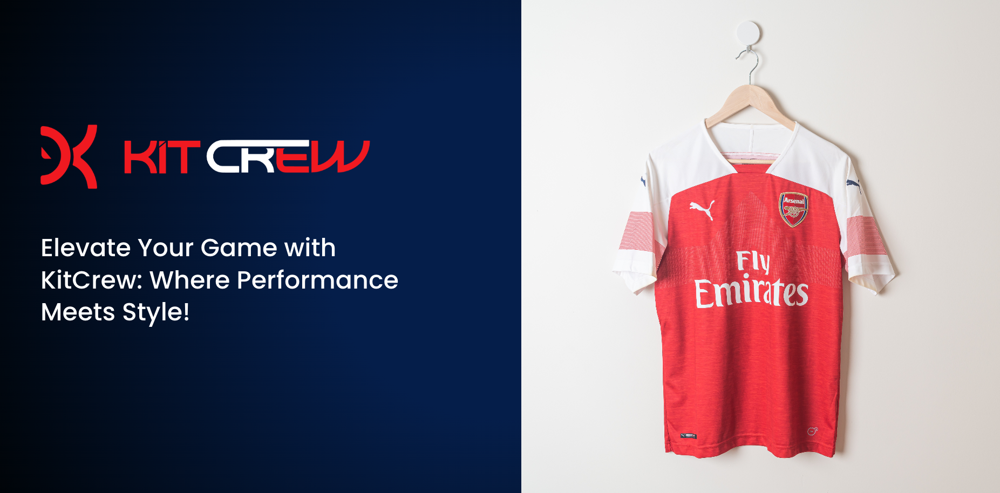
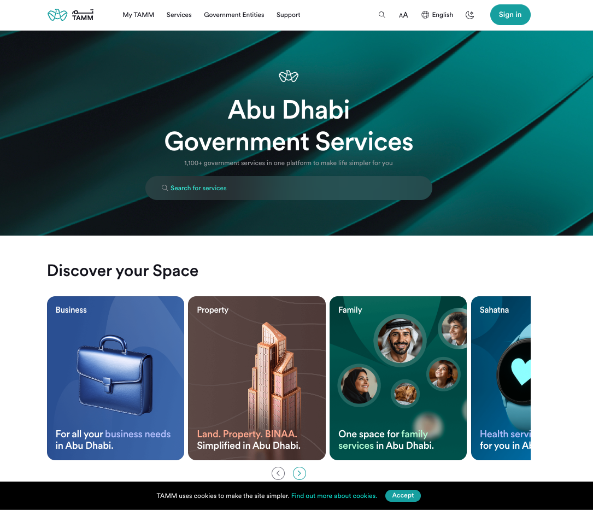
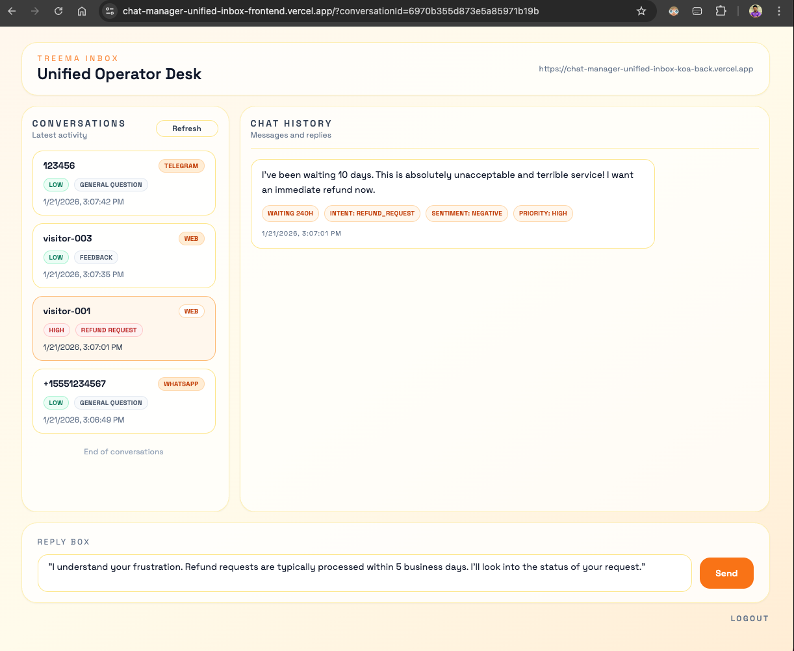
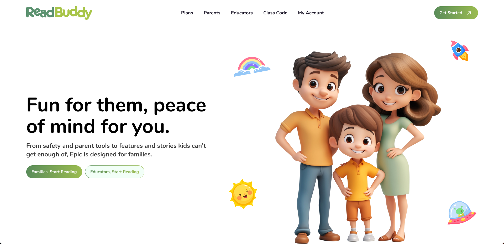
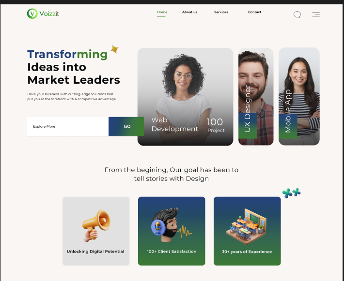
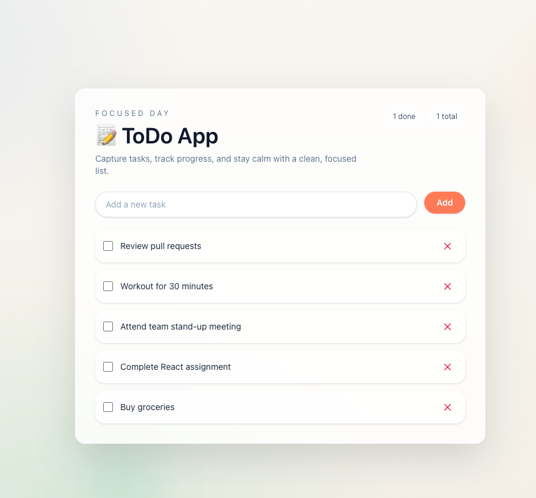
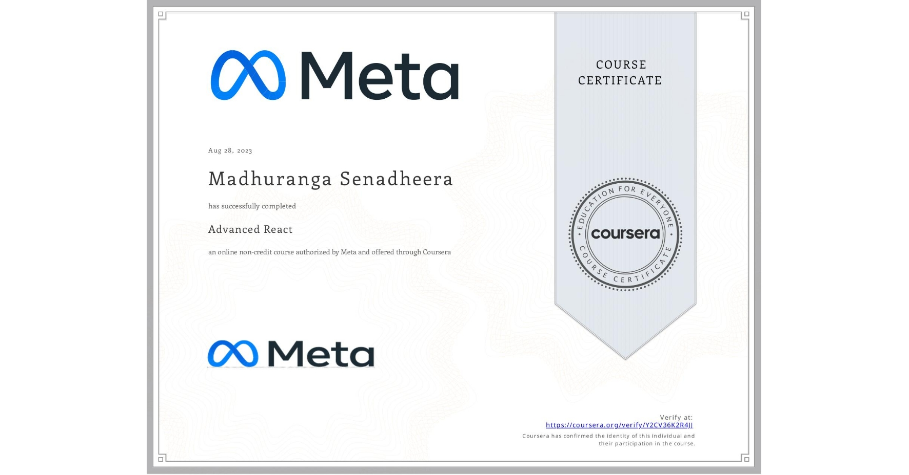
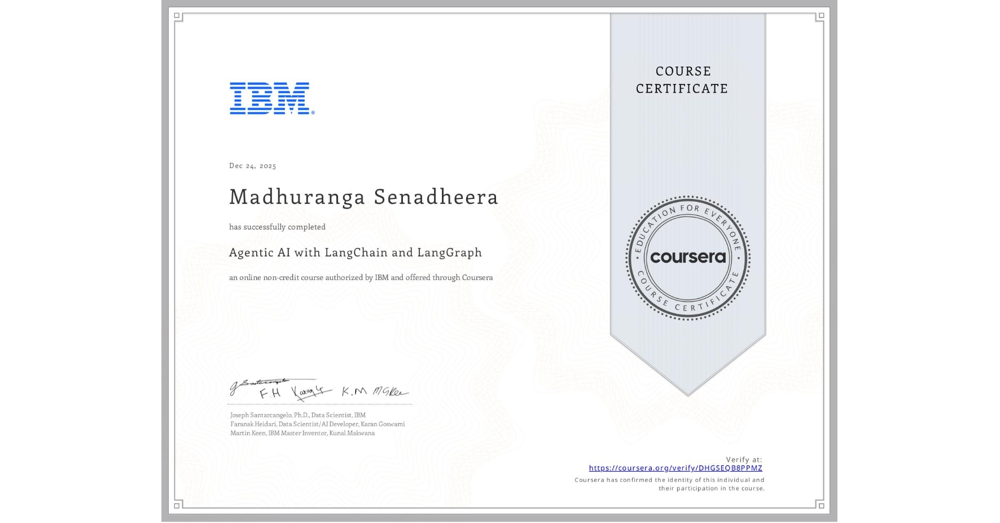

# Maduranga Senadheera

**Senior Full Stack Developer**

  

📍 Dubai, UAE · 📧 [lilan.maduranga@gmail.com](mailto:lilan.maduranga@gmail.com) · 📞 +94 740-40-63-05 ·
💼 [LinkedIn](https://www.linkedin.com/in/lmadhuranga/) · 💻 [GitHub](https://github.com/lmadhuranga)

---

## 👋 About Me

Senior Full Stack Developer with **10+ years of experience** building scalable web applications, enterprise platforms, and government systems.
Strong focus on **performance, clean architecture, and maintainable code**.

I work across frontend, backend, and AI-powered systems, delivering reliable and user-focused solutions.

---

## 🧠 Tech Stack

| Category         | Technologies                          |
| ---------------- | ------------------------------------- |
| **Frontend**     | React, Next.js, TypeScript, HTML, CSS |
| **Backend**      | Node.js, NestJS, REST APIs            |
| **Databases**    | PostgreSQL, MongoDB                   |
| **Architecture** | Microservices, Clean Architecture     |
| **AI / LLM**     | OpenAI, Gemini, LangChain, LangGraph  |
| **Other**        | SSR/SSG, SEO, Multi-tenant systems    |

---

## 💼 Experience (Summary)

* **Senior React & Node.js Developer** — Voizzit (Dubai)
* **React & Node.js Developer** — TAMM (Abu Dhabi Government)
* **Senior Software Developer** — Softlogic Life Insurance

> Full experience details available in the portfolio website.

---

## 🚀 Projects

### KitCrew – E-Commerce Platform

  

Multi-tenant soccer jersey e-commerce platform with SSR, SEO optimization, and internationalization.
**Tech:** Next.js · React · Node.js · PostgreSQL

---

### TAMM – Government Services Platform

  

Abu Dhabi Government digital platform integrating multiple services into a unified citizen experience.
**Tech:** React · Node.js · Government APIs

---

### Treema – AI Operator Desk

  

AI-powered unified inbox that analyzes messages, detects intent and sentiment, and suggests responses using LLMs.
**Tech:** React · Node.js · OpenAI · Gemini · LangChain · LangGraph

---

### Read Buddy – Read-to-Me App

  

OCR-based application that extracts text from images, generates audio narration, and highlights words interactively.
**Tech:** React · OCR · AI · Text-to-Speech

---

### Voizzit – Commerce Platform

  

Large-scale commerce platform focusing on performance, SEO, and reusable UI architecture.
**Tech:** Next.js · React · Node.js

---

### Todo Application

  

Simple task management application demonstrating clean state management and component structure.
**Tech:** React · TypeScript

---

## 🎓 Certifications

### Advanced React — Coursera (Meta)

  

* Advanced component patterns & reusability
* API integration & async data handling
* Testing with React Testing Library
  🔗 [Verify Certificate](https://www.coursera.org/account/accomplishments/verify/Y2CV36K2R4JJ)

---

### Agentic AI with LangChain & LangGraph — Coursera (IBM)

  

* Agent-based AI workflows & decision graphs
* Reflection, ReAct & multi-agent orchestration
* Agentic RAG & retrieval-enhanced reasoning
  🔗 [Verify Certificate](https://www.coursera.org/account/accomplishments/verify/DHGSEQB8PPMZ)

---

## 📬 Contact

📍 Dubai, UAE · 📧 **[lilan.maduranga@gmail.com](mailto:lilan.maduranga@gmail.com)** · 📞 **+94 740-40-63-05** ·
💼 [LinkedIn](https://www.linkedin.com/in/lmadhuranga/) · 💻 [GitHub](https://github.com/lmadhuranga)

---

© 2026 **Maduranga Senadheera**
Senior Full Stack Developer

---
